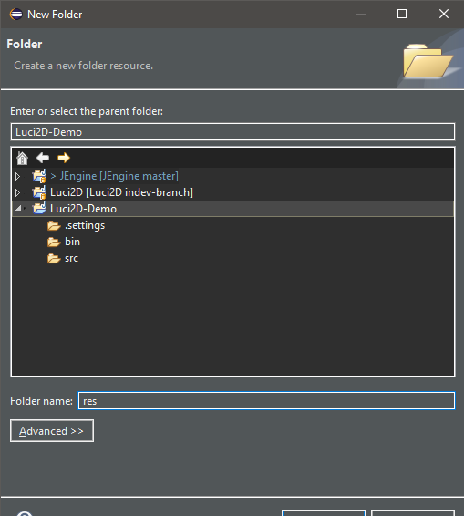
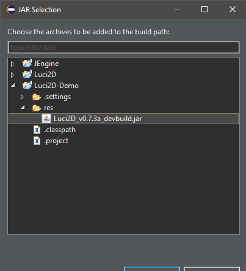
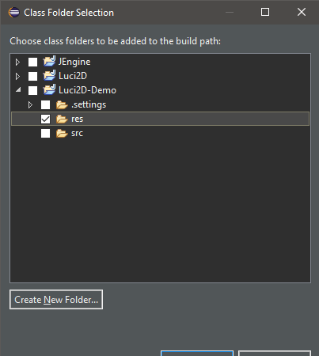
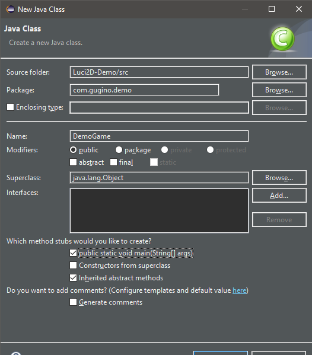

# **Luci2D**

#### Created by: Gugino
#### version 0.2.7.3a

Luci2D is a 2D game framework built upon java's awt library with the goal of providing a more user friendly alternative for creating 2D games using vanilla java.

**DISCLAIMER: LUCI2D is solely maintained by Gugino so please be patient with updates and bug fixes. Also if anyone who would like to contribute to the LUCI2D project please submit a pull request, or you can reach out to me directly on [Twitter](https://twitter.com/JoshuaGugino).**


## **WORK IN PROGRESS - WILL BE UPDATED SOON**

## **Getting Started**

- [Setting up your project](#setting-up-your-project)
    - [Eclipse Setup](#eclipse-setup)
    - [Basic Game Setup](#basic-game-setup)

- [Working with the StateManager](#working-with-the-statemanager)

- [Rendering Shapes/Text/Images/UI](#rendering-shapeimagestextui)

- [Getting Input](#getting-input)

- [Working with GameObjects](#working-with-gameobjects)

- [Adding in audio](#adding-audio)

- [Working with TileMaps](#working-with-tilemaps)

- [Playing with particles](#playing-with-particles)

---

## Setting up your project

To begin working with the Luci2D framework first you can either compile the jar file yourself by cloning the master branch of the repository. Alternatively you can download a pre-compiled jar file from [here](#jar-download). The pre-compiled jar will always be compiled from the most stable version of the `master` branch, so you can rely on this to be stable for production projects.

**Luci2D version 0.7.3a : [Download]()**

### Eclipse Setup:

1. To begin start by opening the Eclipse IDE, once started click `File`, `New -> Java Project` and follow the prompts to setup a basic Java Project.
<br/>
<br/>

1. Once you have created a new project you to want add the `Luci2D_(version).jar` to your projects referenced libraries, also at this point it is useful to add a `res` class folder to your build path as well for future use with referencing images/audio.
   - To create the resource folder that Luci2D relys on to load images/audio files, first right click the root of the newly created project the select `New -> Folder`. Once the folder is created drag and drop the download `Luci2D_(version).jar` into the folder, and when prompted to copy files click ok.
   <br>
   <br>
   
   - Right click the root of your newly created projects and select the `Properties` option. Once the window opens Select `Java Build Path` on the left side of the window, then click the `Libraries` tab on the right side panel in the `Properties` window. After the `Libraries` tab is selected press the `Add JARs` button, then navigate to the `Luci2D_(version).jar` you added to the res folder and then press OK.
   <br>
   <br>
   
   - Now to added the `res` folder as a class folder, within the same `Properties` window you added the jar file in press the `Add Class Folder` button then select the `res` folder inside your project.
   <br>
   <br>
   

    <br>
    <br>

 ## Basic Game Setup
1. To get a basic window up and running with Luci2D is quite simple, to begin by creating a new java file which includes a `main` method. The package structure does not effect any functionally so you can organize your project anyway you see fit.
<br>
<br>

2. Once you have created the new class make sure the class extends `Game`, and implement any required methods (All classes that inherit from the `Game` class need the `start(GameManager _gm, Renderer _r)`, `update(GameManager _gm, double _delta)`, and `render(GameManager _gm, Renderer _r)` methods.).
    ```
    package com.gugino.demo;

    import com.gugino.engine.Game;
    import com.gugino.engine.GameManager;
    import com.gugino.engine.loops.Renderer;

    public class DemoGame extends Game{

        public DemoGame(){
        }

        public static void main(String[] args) {

	    }

        public void start(GameManager _gm, Renderer _r){

        }

        public void update(GameManager _gm, double _delta){

        }

        public void render(GameManager _gm, Renderer _r){

        }
    }
    ```
3. After you have your class extending `Game` and you have all the required methods implemented, inside the constructor for your class put the following code to initialize the `GameManager`. When creating a new instance `GameManager` there are 2 version of the constructor, version 1 takes in the `Window Width`, `Window Height`, and a reference to the `Game` class. Version 2 take in the `Window Title`, `Window Width`, `Window Height`, `isResizable`, and a reference to the `Game` class.
   ```
    public DemoGame(){
         //GameManager(_windowTitle, _windowWidth, _windowHeight, _resizable, _game)
        new GameManager("Demo Game", 800, 600, false, this);
    } 
   ```
4. After you have the `GameManager` created all thats left now is too create an instance of the created class inside the main method.
   ```
     public DemoGame(){
         //GameManager(_windowTitle, _windowWidth, _windowHeight, _resizable, _game)
        new GameManager("Demo Game", 800, 600, false, this);
    }

    public static void main(String[] args){
        new DemoGame();
    }
   ```
- **NOTE: To hide the debug information that shows by default, simply change the `showDebugInformation` boolean inside the created instance of `GameManager` to `false`.**
  ```
    public DemoGame(){
        GameManager _gm = new GameManager("Demo Game", 800, 600,false, this);
        _gm.showDebugInformation = false;
    }
  ```
---

## Working with the StateManager
- Now that you have the base for your game created we can use the `StateManager` to give us the ability to setup multiple different states and seamlessly switch between them.
  
1. To get started using the `StateManager` first new need to create a new class for our state. This can be done the same way as when creating the main game class, however this class does not need the `main` method unlike the game class. Once you have created the class make sure the class extends `GameState` and implement all the required methods. Inheriting from GameState also requires you to create a constructor for the state with a argument for the states ID.
   ```
    package com.gugino.demo.states;

    public class DemoState extends GameState{

        public DemoState(int _stateID){
            super(_stateID);
        }

        @Override
	    public void start(GameManager _gm, Renderer _r) {
		
	    }

	    @Override
	    public void update(GameManager _gm, double _delta) {
        
	    }
	
	    @Override
	    public void render(GameManager _gm, Renderer _r) {
		
	    }
    }
   ```
2. After the class for the `GameState` is created you must add it to the StateManager, this is done by calling the `addState(int _stateID, GameState _state)` method within the StateManager which takes in the ID for the `GameState` as well  as the `GameState` to add.
   - **Note: States should be added with in the `start()` method of the main game class. Also to set the active `GameState` call the `setActiveState(int _stateID)` within the `StateManager` class which takes in the ID of the `GameState` you want to switch to.**
        ```
        public class DemoGame extends Game{
            public void start(GameManger _gm, Renderer _r){
            
                //Adds state to StateManager
                //addState(int _stateID, GameState _state);
                _gm.stateManager.addState(0, new DemoState(0));

                //Sets the active GameState
                _gm.stateManager.setActiveState(0);
            }
        }
        ```
---

## Rendering Shape/Images/Text/UI

---

## Getting Input

---

## Working with GameObjects

---

## Adding Audio

---

## Working with TileMaps

---

## Playing with particles

---
